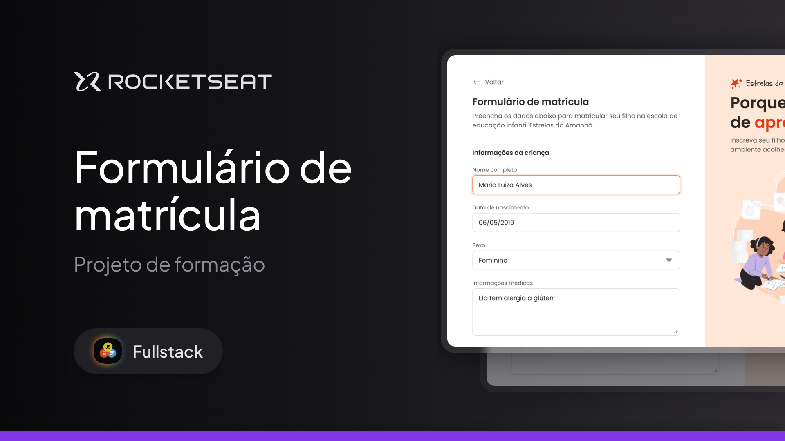

<h1 align="center">Estrelas do Amanhã</h1>

Projeto da formação de #FullStack.

  <a href="#-tecnologias">Tecnologias</a>&nbsp;&nbsp;&nbsp;|&nbsp;&nbsp;&nbsp;
  <a href="#-projeto">Projeto</a>&nbsp;&nbsp;&nbsp;|&nbsp;&nbsp;&nbsp;
  <a href="#-estude">Estude com a RocketSeat</a>&nbsp;&nbsp;&nbsp;|&nbsp;&nbsp;&nbsp;

 

  

## 🚀 Tecnologias

Esse projeto foi desenvolvido com as seguintes tecnologias:

- HTML e CSS
- Git e Github
- Figma

## 💻 Projeto

O projeto consistia em criar uma landpage um formulário de matrícula para uma escola de educação infantil. Trabalhamos com diversos tipos de input além de rever e treinar bastante o CSS. 

Havia o design pronto no #Figma e com base as aulas anteriores precisávamos tentar reproduzir-lo.

- [Acesse o projeto finalizado](https://github.com/itsjrsouza/formregis)

## 🔖 Estude

Quer ter o prazer de desenvolver esse projeto e outros? Vem estudar com a RocketSeat!

[Formação Full Stack:](https://app.rocketseat.com.br/cart/formacao-fullstack?referral=itsjrsouza&coupon=indicamgm&utm_source=platform&utm_medium=organic&utm_campaign=venda&utm_term=mgm&utm_content=indication-lp_one)

[RocketSeat One](https://app.rocketseat.com.br/cart/rocketseat-one?referral=itsjrsouza&coupon=indicamgm&utm_source=platform&utm_medium=organic&utm_campaign=venda&utm_term=mgm&utm_content=indication-lp_one)

Feito com ♥ by Rocketseat :wave: [Participe da nossa comunidade!](https://discord.gg/rocketseat)